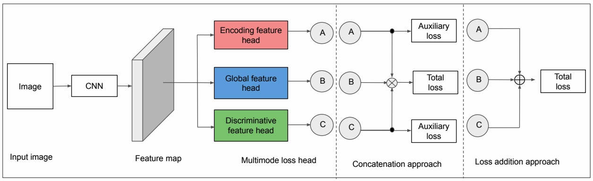

# Document Image Analysis using Deep Multi-modular Features
## Official Project Webpage
A deep network architecture that independently
learns texture patterns, discriminative patches, and shapes to solve
various document image analysis tasks. [PDF](https://link.springer.com/article/10.1007/s42979-022-01414-4)

<p align="center">

<em>
<p>
Presents a block diagram of the proposed approach. The input image passes through the layers of convolutional filters of an CNN architecture to extract convolutional features. From the convolutional feature, the model extracts three different modalities of features: an encoding feature, a global feature, and a discriminative feature.
</p></em>

This repository provides the official PyTorch implementation of the Journal:
> **Document Image Analysis using Deep Multi-modular Features** <br>
> Jobin K.V., Ajoy Mondal, and C. V. Jawahar<br>
> In SNCS 2022<br>
>[PDF](https://cvit.iiit.ac.in/images//JournalPublications/2022/Multi_modular.pdf)

> **Abstract:** *
Texture or repeating patterns, discriminative patches, and shapes are the salient features for various document image analysis problems. This article proposes a deep network architecture that independently learns texture patterns, discriminative patches, and shapes to solve various document image analysis tasks. The considered tasks are document image classification, genre identification from book covers, scientific document figure classification, and script identification. The presented network learns global, texture, and discriminative features and combines them judicially based on the nature of the problems to be solved. We compare the performance of the proposed approach with state-of-the-art techniques on multiple publicly available datasets such as Book-Cover, RVL-CDIP, CVSI and DocFigure. Experiments show that our approach outperforms genre and document figure classifications more than state-of-the-art and obtains comparable results on document image and script classification tasks.
*<br>

## Pytorch Implementation
### Installation
```
conda create --name dmmf python=3.8
conda activate dmmf
conda install -y pytorch=1.4.0 torchvision=0.5.0 cudatoolkit=10.1 -c pytorch
```

install pytorch encoding from [here](https://hangzhang.org/PyTorch-Encoding/notes/compile.html)
<br>
To check the installation of pytorch encoding
<br>
run in python console
```
import encoding
```

After installing encoding, clone this repo
```
git clone https://github.com/jobinkv/Deep_Multi-modular_Features.git
cd Deep_Multi-modular_Features
```

### The datasets
We use four different datasets 

+ RVL-CDIP dataset [link](https://adamharley.com/rvl-cdip/)
+ DocFigure dataset [link](http://cvit.iiit.ac.in/usodi/Docfig.php)
+ Book cover dataset [link](https://github.com/uchidalab/book-dataset)
+ CVSI dataset [link](http://www.ict.griffith.edu.au/cvsi2015/Dataset.php)


### Trained model
+ Script classification [link](https://iiitaphyd-my.sharepoint.com/:u:/g/personal/jobin_kv_research_iiit_ac_in/ESrA2swurhRDgZt7LAuP6GQBGw6uu9ula0t4hNjB2z9jsA?e=3jD1ig)
+ 
=====END=========

